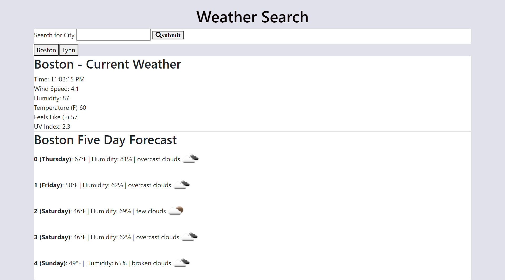

# 06HW-06-Weather-Dashboard-API
#### Jonathan Gilbert
#### Github -  https://github.com/JGilb28-7/06HW-06-Weather-Dashboard-API.git
#### Deplpoyment -  https://jgilb28-7.github.io/06HW-06-Weather-Dashboard-API/.

### Assignment

Homework 06 Server-Side APIs: Weather Dashboard - 

Used the [OpenWeather API](https://openweathermap.org/api) to retrieve weather data for cities. tent data.

## Tasks
Optained the openweathermap key: *****d96a24410b758f22678b531* protected key

## Resources used:
Google
Openweatherapp.org - API Documentation
Class activities - used the Movie references and 05-Bujumbura
 ]
https://stackoverflow.com/questions/49640174/building-a-5-day-forecast-using-open-weather-api-ajax-and-js
https://sceendy.com/blog/2017/09-27-weather-widget-tutorial/

looping over the dt_txt - tried to loop over see committs from 11/9/2020.
https://stackoverflow.com/questions/62004236/nested-loops-looping-through-open-weather-api-and-classes-in-html

Time in the Array for 5 day.
https://stackoverflow.com/questions/56070796/show-day-name-instead-of-number-from-open-weather-api-response - needed to change the isoString to local 

Loops: using the forIndex
 https://developer.mozilla.org/en-US/docs/Web/JavaScript/Guide/Loops_and_iteration - line 17 as example.
https://developer.mozilla.org/en-US/docs/Web/JavaScript/Reference/Global_Objects/Array/indexOf
arr.indexOf(searchElement[, fromIndex]) - example

updating the array for 5 day:
https://stackoverflow.com/questions/56070796/show-day-name-instead-of-number-from-open-weather-api-response

https://developer.mozilla.org/en-US/docs/Web/JavaScript/Guide/Loops_and_iteration - line 17 as example.

https://developer.mozilla.org/en-US/docs/Web/JavaScript/Reference/Global_Objects/Array/indexOf
example: arr.indexOf(searchElement[, fromIndex])

https://youtu.be/DdkQ6eWDPZk - found helpful for looking the time formatting - lon and lat - stack example better with the re-work!

## Acceptance Criteria

GIVEN a weather dashboard with form inputs - completed used input
WHEN I search for a city - complete
THEN I am presented with current and future conditions for that city and that city is added to the search history - complete
WHEN I view current weather conditions for that city - complete 

city name - complete
the date - complete
an icon representation of weather conditions - complete
the temperature - complete
the humidity - complete
the wind speed - complete 
the UV index - complete - no colors on HTML however this would be if / else statemets if above if else below else below and would set the colors in .css for future re-tune

view future weather conditions for that city - 5 day complete - 100%
I am presented with a 5-day forecast that displays the date - day
an icon representation of weather conditions - complete
the temperature - complete
and the humidity - complete

click on a city in the search history - complete 
 

The following image demonstrates the application functionality:

